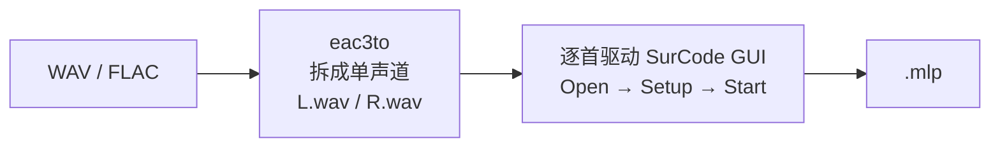

# DVD-Audio Maker

把高解析度音频（FLAC / ALAC-M4A）制作成 **DVD-Audio** 光盘 ISO 的工具链。

针对 **24-bit / 48 kHz、44.1 kHz** 音源，使用 **MLP（Meridian Lossless Packing）
无损压缩** —— 约 9 GB 的源文件可压到约 7 GB，从而装入两张单层 DVD-5。

> 本仓库**不包含任何音频文件**。你需要自备音源。

---

## 快速开始

### 1. 准备环境（WSL2 + Ubuntu）

```bash
# 基础依赖
sudo apt install python3 ffmpeg make gcc autoconf xorriso \
                 libavcodec-dev libavformat-dev libavutil-dev libswresample-dev

# 确认 ffmpeg 支持 MLP 编解码
ffmpeg -hide_banner -encoders | grep mlp
# 应输出:  A..X.D mlp   MLP (Meridian Lossless Packing)
```

### 2. 获取 dvda-author 源码并打补丁

```bash
sudo git clone https://github.com/fabnicol/dvda-author /opt/dvda-author
cd /opt/dvda-author

# 上游 bug 修复（3 个，构建前提）
python3 /path/to/DVD-Audio-Maker/fixes/fix_merged_and_audio_close.py
python3 /path/to/DVD-Audio-Maker/fixes/fix_close_handles.py
python3 /path/to/DVD-Audio-Maker/fixes/fix_secure_mkdir.py

./configure --enable-core-build && make -j2
```

### 3. 构建支持 24-bit MLP 的 dvda-author

```bash
bash build_dvda_author_mlp.sh
# 产物: /root/dvda-author-mlp8/src/dvda-author-dev
```

该脚本是**幂等**的，可重复运行。它会链接系统 FFmpeg 8 并把 `mlp.c`
迁移到 8.x API（详见下文「为什么需要重新编译」）。

### 4. 改配置

**只需要改 `config.sh` 这一个文件。**

```bash
cp config.sh config.sh.bak    # 可选
nano config.sh
```

最简情况下只改 2 行：

```bash
DVDA_SRC="/mnt/d/MyMusic"        # 你的音源根目录
DVDA_FINAL_DIR="/mnt/d/DVD_Out"  # ISO 输出到哪里
```

查看当前生效的配置：

```bash
python3 dvda_config.py
```

### 5. 运行

```bash
bash build.sh              # 完整流水线
bash build.sh --dry-run    # 只预览分盘结果，不出盘
bash build.sh --config     # 只打印配置

# 校验成品
bash verify.sh
```

> **已经有 MLP 文件、不想再转码？** 把 `DVDA_MLP_SOURCE` 设为 `external`
> 并指向 MLP 目录，流水线会**跳过编码**直接用它们出盘。
> 见 [直接用已有 MLP](#直接用已有-mlp不再转码)。

### 6. （可选）生成 MLP 要用什么工具

本仓库默认用 ffmpeg 自己编码，**不需要额外工具**。
本节只对「想用外部工具生成 MLP」的人有意义，不需要就跳过。

MLP 是封闭的专有格式，**SurCode MLP Encoder**（Minnetonka，Windows 商业软件）
是参考实现；ffmpeg 的 `mlp` 编码器是开源替代品。

三条路线：

| 路线 | 需要什么 | 说明 |
|------|----------|------|
| **A. ffmpeg**（默认） | 只需 ffmpeg | 本仓库已集成，无额外工具 |
| **B. Batch MLP Encoder 3** | SurCode MLP + eac3to + .NET 4.6（Windows） | 半自动；见下 |
| **C. SurCode MLP 手工操作** | SurCode MLP（Windows） | 每首手工做一遍；见下 |

---

#### A. 用本仓库自带的 ffmpeg 编码（推荐）

什么都不用装。`config.sh` 里 `DVDA_MLP_SOURCE="ffmpeg"`（默认）即可，
`02_build.py` 会直接从音源编码 MLP，不产生中间 WAV。

---

#### B. Batch MLP Encoder 3

用于把 SurCode 的操作流程自动化：SurCode **没有命令行**且**只接受单声道 WAV**，
本工具会替你拆成 `L.wav`/`R.wav` 并逐首驱动 SurCode。

- 项目：`Batch MLP Encoder 3`（作者 SadPencil，GPL v2.0，v3.0.6）
- 运行环境：**Windows**（Vista SP2 及以上）+ .NET Framework 4.6+
- **依赖两个外部程序**（不自带，需自行安装，并在向导里指定路径）：
  - `SurCode MLP Encoder`（`surcodemlp.exe`）
  - `eac3to`（`eac3to.exe`）
- 用法：向导式 5 步 —— 指定两个程序路径 → 拖入文件 → 选参数 →
  设临时/输出目录 → 开始

内部流程：



**使用注意事项**：

- **文件名或目录含特定字符（例如韩文）会让 SurCode 出错** ——
  程序会自动换成临时名先编，编完再改回
- 它是 **GUI 自动化**（用 UI Automation 点菜单），界面变化、弹窗、
  超时都会失败；程序为每步都设了超时与重试
- **20-bit 没有对应的 WAV 容器**，会以 24-bit 存放，输出可能是 24-bit
- 勾了重采样／升位深时，音频会被**改过** ——
  例如勾 `-resampleTo48000` 后，全部曲目都会变成 48000 Hz
  （见 [外部模式的两个行为差异](#外部模式的两个行为差异)）

> 本仓库**不包含也不依赖**这个工具，也不替它做任何事。
> 用它编完 MLP 后，再用本仓库的
> [外部模式](#直接用已有-mlp不再转码)出盘即可。

---

#### C. 直接用 SurCode MLP 手工操作

没有 Batch MLP Encoder 时的原始方法，需**每首曲目手动做一遍**：

1. 用 eac3to（或其它工具）把音源拆成单声道 WAV
2. 在 SurCode 里 `Open` 逐声道导入
3. `Setup` 里设采样率/位深
4. `Start` 编码，再 `Save` 到目标路径

> 无论用 B 还是 C，**出盘时仍然需要音源文件**（MLP 容器不存标签也不存时长），
> 见[直接用已有 MLP](#直接用已有-mlp不再转码)里的限制说明。

---

### 7. （可选）把 M4A / ALAC 音源转成 FLAC

本流水线**可以直接读 M4A** —— `01_prepare.py` 会顺手修掉 Apple ALAC 的缺 END
标记问题（见下方「自动修复」一节）。如果你想把音源先统一成 FLAC，用
`m4a2flac.py`：

```bash
python3 m4a2flac.py /path/to/music           # 目录递归
python3 m4a2flac.py a.m4a b.m4a --in-place   # 指定文件，转完删掉源
python3 m4a2flac.py /path/to/music --dry-run # 先看会做什么
```

依赖 `ffmpeg` / `ffprobe` / `metaflac`（`sudo apt install ffmpeg flac`）。

它做三件普通转换工具不做的事：

| 项 | 普通转换工具 | `m4a2flac.py` |
|---|---|---|
| ALAC 缺 END 标记 | 静默丢帧，并被固化进 FLAC | 先修补再转 |
| 标签名 | MP4 名原样写入（FLAC 播放器读不到） | 规范化，并剔除 MP4 容器专用标签 |
| 封面 | `type=0 (Other)`、`depth=12` | 重导为 `type=3 (Cover front)`、`depth=24` |

转完做三重校验：PCM MD5 与**修复后**的源逐字节一致、标签逐项比对、封面字节
比对。任一不过就删掉半成品并报错。

选项：`--in-place`（转成功后删源）、`--level 0-8`（默认 8）、`--jobs N`、
`--dry-run`。

> 输出与源**同目录同名**，只是扩展名换成 `.flac`。那里若已有同名 `.flac`
> 会被覆盖。

---

## 路径怎么写

`config.sh` 里的路径是 **WSL 内**的写法。Windows 路径的换算规则：

| Windows | WSL |
|---------|-----|
| `C:\Users\me\Music` | `/mnt/c/Users/me/Music` |
| `D:\Music\Albums` | `/mnt/d/Music/Albums` |
| `E:\` | `/mnt/e` |

要点：

- 盘符小写，`\` 换成 `/`
- 路径含空格时**保留引号**：`DVDA_SRC="/mnt/d/My Music/Albums"`
- 输出目录**不需要预先创建**，出盘时会自动建

### 完整示例

假设你的音乐在 `D:\Music\MyAlbums\`，按专辑分了子目录：

```
D:\Music\MyAlbums\                      <- DVDA_SRC 指向这里
├── Album A (2024)\
│   ├── 01. First Song.flac
│   └── 02. Second Song.flac
├── Album B (2025)\
│   ├── 01. Song One.flac
│   └── 02. Song Two.m4a
└── Album C - Single\
    └── 01. Only Song.flac
```

想让 ISO 出现在 `D:\DVD_Output\`，则 `config.sh` 中：

```bash
DVDA_SRC="/mnt/d/Music/MyAlbums"
DVDA_FINAL_DIR="/mnt/d/DVD_Output"
DVDA_BUILD_DIR="/root/dvda-build"      # 建议留在 WSL 内部
DVDA_TITLE="My DVD-Audio"              # 卷标: "My DVD-Audio 1", "My DVD-Audio 2"
```

产出：

```
D:\DVD_Output\My_DVD_Audio_1.iso
D:\DVD_Output\My_DVD_Audio_2.iso
```

启动时 `build.sh` 会回显所有生效路径，运行前可先核对一遍：

```
============================================================
 DVD-Audio Maker
============================================================
  音源     : /mnt/d/Music/MyAlbums
  输出     : /mnt/d/DVD_Output
  工作目录 : /root/dvda-build
  光盘标题 : My DVD-Audio    (卷标: "My DVD-Audio 1", ... ; 文件名前缀: My_DVD_Audio)
  日志     : /root/dvda-build/build.log
```

> **为什么工作目录建议放 WSL 内部**
>
> 从 `/mnt/c`（9p 文件系统）读写比 WSL 内的 ext4 慢一个数量级。
> MLP 缓存可达数 GB，放在 `/mnt/c` 会让整个流程慢好几倍。
> 音源和输出放 Windows 盘没问题（音源只读一次、输出是最终复制）。

### 音源的组织要求

| 要求 | 原因 |
|------|------|
| 格式 `.flac` 或 `.m4a`（ALAC） | 递归扫描，深度不限 |
| 带 `date` 标签 | 决定专辑先后顺序 |
| 带 `track` 标签 | 专辑内曲序 |
| 带 `album` 标签，**同专辑必须完全一致** | 专辑归一化与「专辑不拆散」分盘都依赖它 |
| 声道数一致（全立体声或全单声道） | 本工具不做声道转换 |

采样率与位深**可以混用**（44.1k / 48k / 96k，16-bit / 24-bit）：脚本会按专辑
做归一化 —— 同专辑内以「多数采样率 + 该采样率下多数位深」为准，少数曲目自动
重采样，保证整张专辑连续播放。

### 磁盘空间

```
工作目录  约 = 源文件总大小 × 0.9   (MLP 缓存)
输出目录  约 = 源文件总大小 × 1.1   (ISO)
```

---

## 目录结构

```
DVD-Audio-Maker/
├── README.md
├── LICENSE                      # GPL-3.0 全文
├── config.sh                    # ★ 唯一需要修改的文件
├── dvda_config.py               # 配置加载器（bash 与 Python 共用）
├── build.sh                     # 一键流水线
├── 01_prepare.py                # 步骤1：扫描 + 专辑归一化 + 解码校验
├── 02_build.py                  # 步骤2：MLP 编码 → 分盘 → 出盘 → 打包 ISO
├── mlp_align.py                 # MLP 输出合规性校验与修补
├── alac_endfix.py               # 修复 Apple ALAC 未压缩帧缺 END 标记
├── m4a2flac.py                # M4A/ALAC → FLAC（修缺陷、规范化标签与封面）
├── verify.sh                    # 成品校验入口
├── audit_disc.py                # 光盘一致性审计
├── check_aob_pts.py             # AOB 逐扇区 PTS 检查
├── verify_pts_length.py         # 逐轨 PTS_length 与源时长比对
├── build_dvda_author_mlp.sh     # 重编支持 24-bit MLP 的 dvda-author
├── patches/                     # 重编所需的源码补丁（5 个）
├── fixes/                       # /opt/dvda-author 的上游 bug 补丁（3 个）
└── docs/
    ├── TROUBLESHOOTING.md       # 问题诊断记录与修复细节
    └── LICENSING.md             # 许可状况、第三方归属与法律说明
```

---

## 配置项一览

全部在 `config.sh` 中。**优先级：环境变量 > config.sh > 内置默认值**。

| 配置项 | 默认值 | 说明 |
|--------|--------|------|
| `DVDA_SRC` | *(空，必填)* | 音源根目录（只读） |
| `DVDA_FINAL_DIR` | *(空，必填)* | ISO 输出目录 |
| `DVDA_BUILD_DIR` | `/root/dvda-build` | 中间产物根目录，**建议放 WSL 内部** |
| `DVDA_TITLE` | `My DVD-Audio` | 光盘卷标；也是 ISO 文件名前缀的来源 |
| `DVDA_ISO_PREFIX` | *(空)* | ISO 文件名前缀，留空由 `DVDA_TITLE` 派生 |
| `DVDA_MAX_DISCS` | `2` | 期望的盘数上限；仅用于「放不放得下」的判断与提示，**不参与切分**；`0` = 不检查 |
| `DVDA_GROUP_TRACK_LIMIT` | `64` | 每组最多轨数，**不要超过 70**（栈溢出） |
| `DVDA_DISC_BYTES` | `4707319808` | 单盘容量上限（字节）；双层 DVD-9 可设 `8540123136` |
| `DVDA_MLP_SOURCE` | `ffmpeg` | MLP 来源：`ffmpeg`（本工具链编码）/ `external`（用外部编码器产出） |
| `DVDA_MLP_EXTERNAL_DIR` | *(空)* | 外部 MLP 根目录（仅 `external` 时用；结构须与音源一一对应） |
| `DVDA_AUTHOR` | `/root/dvda-author-mlp8/src/dvda-author-dev` | 自编译 dvda-author |
| `DVDA_MKISOFS` | `/opt/dvda-author/local.ubuntu.20.10/bin/mkisofs` | patched mkisofs |
| `DVDA_FFMPEG` / `DVDA_FFPROBE` | `ffmpeg` / `ffprobe` | 用 PATH 解析 |
| `DVDA_AUTHOR_SRC` | `/root/dvda-author-mlp8` | 编译目录 |
| `DVDA_AUTHOR_ORIG` | `/opt/dvda-author` | 原始源码目录 |
| `DVDA_LOSS_ERROR_S` | `0.05` | 解码采样数缺失超过此秒数 → FAIL |
| `DVDA_LOSS_WARN_S` | `0.005` | 采样数差异超过此秒数 → WARN |

派生路径（都在 `DVDA_BUILD_DIR` 下，无需配置）：

```
manifest.json     清单（步骤1 产出，步骤2 读取）
mlp_index.json    MLP → 源文件/时长/重采样 索引 + 分盘计划
                   （`__discs__` 段记录每盘/每组/每轨 → 源 MLP）
decode_report.txt 解码完整性报告
build.log         构建日志（真出盘；含 dvda-author 轨道表）
build-dryrun.log  --dry-run 的日志（不含轨道表）
mlp/              MLP 缓存（可复用，换源后仍有效）
alacfix/          ALAC 修复产物（原文件不改动）
out/ tmp/ iso/    出盘中间目录
```

> 为什么 dry-run 要单独写一份日志：`--dry-run` 不执行 dvda-author，日志里
> 不会有轨道表。若覆盖 `build.log`，`audit_disc.py` / `verify.sh` 就再也取不到
> 上次真出盘的审计依据，会把正确无误的 ISO 判为失败（详见
> [TROUBLESHOOTING](docs/TROUBLESHOOTING.md) 第 12 节）。

用环境变量临时覆盖（不改文件）：

```bash
DVDA_SRC="/mnt/e/其他音源" DVDA_TITLE="Test" python3 01_prepare.py
```

---

## MLP 来源：自己编码还是用外部编码器

默认（`DVDA_MLP_SOURCE="ffmpeg"`）由本工具链用 ffmpeg 的 `mlp` 编码器直接
从音源编码，不产生中间 WAV。

也可以改用外部编码器（如 **SurCode MLP**，MLP 的参考实现），
或者直接拿 **已有的 MLP 文件**。两种情形都走同一个开关。

---

### 直接用已有 MLP（不再转码）

适用：你已用别的工具编好了 MLP，希望本工具链**只做出盘与校验**，
不再碰音频编码。

**第 1 步：把 MLP 按下面的结构放好**

```
<DVDA_MLP_EXTERNAL_DIR>/
├── Album A/
│   ├── 01. First Song.mlp
│   └── 02. Second Song.mlp
├── Album B/
│   └── 01. Song One.mlp
└── …
```

规则只有一条：**把音源路径开头的 `DVDA_SRC` 换成 `DVDA_MLP_EXTERNAL_DIR`，
中间的相对路径原样保留，只把扩展名换成 `.mlp`。**

举例。音源根目录与其中一个文件是：

```
DVDA_SRC = /mnt/d/Music/MyAlbums
音源     = /mnt/d/Music/MyAlbums/Album A/01. First Song.flac
```

设 `DVDA_MLP_EXTERNAL_DIR="/mnt/d/Music/mlp"`，则对应的 MLP 是：

```
MLP      = /mnt/d/Music/mlp/Album A/01. First Song.mlp
```

要换掉的是**整个音源根目录那一段**（上例的 `/mnt/d/Music/MyAlbums`），
不是把它删掉就算了 —— 外部目录的层级完全可以与音源无关，只要
「相对路径那一段」保持原样即可。

镜像路径找不到时，会退回「按**文件名**在整个外部目录里搜一次」——
所以就算 MLP 被平铺在别的层级下也大多能用（但要求文件名唯一）。

**第 2 步：改两行配置**

```bash
DVDA_MLP_SOURCE="external"
DVDA_MLP_EXTERNAL_DIR="/mnt/d/Music/mlp"
```

**第 3 步：先空跑看一眼**

```bash
bash build.sh --dry-run
```

重点看三处输出：

```
已定位 147/147 个外部 MLP            ← 必须 147/147，少了会直接报错退出
[提示] 19 首的参数被外部编码器改过…   ← 外部改了采样率/位深时会列出
--- 第 1 盘: N 个组 ---               ← 分组结果
```

确认无误后 `bash build.sh` 正式出盘。

#### ⚠️ 音源文件仍然必须存在

这是最容易踩的一点：**不能只给 MLP**。原因：

| 还需要音源提供什么 | 用途 |
|--------------------|------|
| `album` / `date` / `track` 标签 | 专辑分组与曲目排序（MLP 容器不存标签） |
| 时长 | 解码完整性校验（MLP 也不存时长） |
| 原生采样率/位深 | 判定外部编码器是否改过参数 |

所以 `DVDA_SRC` 仍要指向原来那批 FLAC/m4a，`01_prepare.py` 会照常扫它们。
只是编码环节被跳过。

> 即：**外部模式换的是“音频从哪来”，不是“元数据从哪来”。**

---

### 用外部编码器现场编码

如果不已有 MLP、而是想让外部编码器现场编（例如 SurCode），
配置与上面完全相同（`DVDA_MLP_SOURCE="external"`），
只要把	t`DVDA_MLP_EXTERNAL_DIR` 指向那个编码器的**输出目录**即可。
本工具链不会去调用该编码器 —— 你需要先把 MLP 编好，再跑出盘。

---

### 外部模式的两个行为差异

**1. 参数以实测为准，不信 manifest**

外部编码器可能改采样率/位深。例如 SurCode 会把**全部曲目统一到 48000/24**，
于是 44100/24 的 13 首、44100/16 的 4 首、48000/16 的 1 首、乃至一首
96000/24 都会被重采样或改位深。

所以外部模式下会逐个 `ffprobe` 实际产出，用**真实参数**做分组与分盘，
并打印一张「源原生 → 外部 MLP」的对照表。这也意味着**外部分盘的盘数与
自己编码可能不同**。

**2. 校验策略会自动放宽**

`verify.sh` 的「MLP 解码 PCM 与源音源逐字节一致」在外部改过采样率时
**不做逐字节比对** —— 外部编码器的重采样滤波器与 soxr 不同，
LSB 差异属预期，强行比对只会误报。此时改为核对
「解码采样数 == 时长 × MLP 采样率」（±50ms）且解码无错误；
`[2] 成品 ISO 内音轨与源 MLP 一致` 仍然逐字节比对（那两边是同一份 MLP）。

### 参考：两套编码器的实测差异

本仓库默认使用 ffmpeg，并对输出自动做头部对齐（下一节）。
下面是两套编码器在**同曲目、同参数**（48000/24 立体声）下的 major sync
（28 字节）对比 —— 只有 3 处不同，其余 25 字节全同：

| 偏移 | 字段 | SurCode | ffmpeg |
|------|------|---------|--------|
| `[14:16]` | `peak_bitrate` | **3200** | 3199 |
| `[16]` | `extended_substream_info` | **1** | 0 |
| `[26:28]` | `checksum16` | 0xb960 | 0x2f92 |

真正影响兼容性的是**流尾部**与**刷新频率**：

| 项 | SurCode | ffmpeg |
|----|---------|--------|
| `END_OF_STREAM`（`0xD234D234`） | 有 | **无** |
| major sync 间隔 | 每 **8** 个 access unit | 每 16 个（默认值） |

major sync 是解码器的重同步点，间隔越短越耐错。本工具链采用 **8** 个
access unit 的间隔，代价是 MLP 体积约 +3.9%（单首 39.8 MB → 41.4 MB）。

> `speaker_layout` / `source_format` / `copy_protection` 两边**都是 0**，
> 属正常，不是缺陷。

---

## 处理逻辑

1. **扫描** FLAC / M4A，用 `ffprobe` 读取参数与标签
2. **专辑归一化**：同一专辑若采样率/位深不一致，以「多数采样率 + 该采样率下多数
   位深」为目标重采样少数曲目，保证整张专辑在同一音频组内连续播放
3. **分组排序**：按 (采样率, 位深) 分组，组内按发布日期 + 曲序排序
4. **解码完整性校验**：每首跑一次「只解码不落盘」的 ffmpeg（`-f null -` + `astats`），
   比对解码采样数与源声明采样数
5. **MLP 编码**：直接以**源文件**为输入（无损，结果缓存复用），
   需归一化的曲目在同一命令内完成 soxr 重采样
6. **分盘**：按专辑发布顺序，**专辑不拆散**，逐盘填满
7. **出盘**：`dvda-author` 生成 `AUDIO_TS`，补齐 AOB 扇区边界
8. **打包**：`mkisofs -dvd-audio` 生成 ISO，复制到输出目录

全程**不产生音频中间文件** —— MLP 直接由源文件编码而来，省下与源同等体量的
落盘和一轮读写 I/O。

### 两条容易被忽略的约束

以下两点若处理不当，会**静默产出错误结果**（`dvda-author` 不会报错），
脚本里已强制处理。

#### 1. 必须显式指定位深

MLP 编码器会**沿用输入的位深**。而 `aresample` 只改采样率、**不改位深** ——
44.1k/16 的源重采样到 48k 后仍是 16-bit，于是被编成 16-bit MLP 混进 24-bit
的音频组：

```
1  04  48000  16  2 L-R  ...   ← 错：整组是 24-bit，这一轨却是 16-bit
```

**处理**：显式传 `-sample_fmt s16p` 或 `s32p`（MLP 只接受 planer 名，
写 `s32` 会报 `not supported`），并在编码后用 `ffprobe` 复核采样率与位深。

#### 2. 时长不可回读，校验要用采样数

MLP 容器**不记录 duration**（`ffprobe` 返回 `N/A`），无法靠回读时长核验完整性。

**处理**：用 `astats` 在同一次解码中取实际采样数，与「源声明时长 × 目标采样率」
比对；并由 `02_build.py` 输出 `mlp_index.json` 记录「MLP → 源文件 / 声明时长 /
重采样目标」，供后续的时长校验脚本（`verify_pts_length.py`）使用。

### 声道数约束

DVD-Audio 同一音频组内所有曲目须同声道数。本工具链**不做声道转换**
（单声道与立体声无法无损互转），因此 `01_prepare.py` 会检查组内声道是否一致，
不一致直接失败。

---

## 校验

```bash
bash verify.sh            # 全部
bash verify.sh capacity   # 单盘容量与结构
bash verify.sh audit      # 光盘一致性审计
bash verify.sh timeline   # AOB 时间轴抽查
bash verify.sh lossless   # MLP 无损性
bash verify.sh config     # 打印当前配置
```

`audit_disc.py` 按音频组独立核对（扇区号在各组内从 0 起）：

| 检查 | 内容 |
|------|------|
| A | 组内 AOB 扇区总数 == 该组轨道表最大末扇区 + 1 |
| B | 组内各轨扇区首尾相接（无缝无叠） |
| C | 每个扇区都有 PTS |
| D | 每个 PTS 下降点恰好落在某轨的首个扇区 |

> 审计会打印所用的构建日志及其修改时间。若目录里残留了上次构建的日志，
> 会把新 AOB 与旧轨道表比对而**误报不一致**，所以脚本按 mtime 取最新者。
> 正常情况下 `build.sh` 每次真出盘都会重写 `build.log`，保留这一份即可。
>
> 注意：`--dry-run` **不碰** `build.log`（只写 `build-dryrun.log`），
> 否则会把真出盘的轨道表冲掉，导致审计与 ISO 无损校验双双误报。

---

## 解码完整性校验

**判定规则**（`01_prepare.py`）：

| 条件 | 判定 |
|------|------|
| stderr 出现解码错误关键字 | **FAIL** |
| 解码采样数比源声明少 > `DVDA_LOSS_ERROR_S` 对应值 | **FAIL** |
| 采样数差异 > `DVDA_LOSS_WARN_S` 对应值 | WARN |
| `astats` 未输出采样数（校验手段本身失效） | **FAIL** |
| 音频组内声道数不一致 | **FAIL** |
| 其余 | 通过 |

基准值 = `源声明时长 × 目标采样率`。

### 自动修复：Apple ALAC 缺 END 标记

检测到解码异常时，会先尝试 `alac_endfix.py` 的修复（见下一节）。
修复成功则重新校验，采样数必须**精确等于**容器声明值，否则仍判 FAIL。

**原文件绝不修改**，修复产物写入 `<BUILD_DIR>/alacfix`，manifest 中通过
`repaired` / `orig_src` 字段记录溯源信息。

**失败时**：打印问题清单 → 写入 `decode_report.txt` → **不生成 `manifest.json`**
→ 以非零码退出 → `build.sh` 的 `set -e` 立即中止。

---

## 它解决了什么

DVD-Audio 制作工具链（[dvda-author](https://github.com/fabnicol/dvda-author)）
停留在 2020 年，直接使用会遇到若干硬障碍。本仓库的主要内容就是这些障碍的
**修复补丁与验证脚本**。下面是这些问题在本工具链里已得到的处理，
排查细节见 [TROUBLESHOOTING](docs/TROUBLESHOOTING.md)。

### 1. 启用 24-bit 无损 MLP 压缩

原版 `dvda-author` 是 core 构建，**不含 MLP**；随包的 FFmpeg 4.2.4 的 MLP
编码器**只支持 16-bit**；`mlp.c` 也是按 FFmpeg 4.x API 写的。

**处理**：重新编译，链接系统 FFmpeg 8，迁移 API，放开 24-bit，并把填充逻辑
改为按 plane 写入。

**结果**：24-bit 音源压缩率约 **18%**，且**解码后与源 PCM 逐字节一致**。

### 2. 修复时间轴（播放加速 / 进度条不可拖）

原版的 PES 时间戳计算有缺陷，导致**每个扇区的 PTS 都是常量**，播放器拿不到
推进的时间戳 —— 表现为**进度条无法拖动**，并可能**加速播放**。

**处理**：修正采样数累积。

| 指标 | 修复前 | 修复后 |
|------|--------|--------|
| `PTS_length` | 0 | 16,084,725 |
| 扇区 PTS | 恒定 98 | 98 → 16,084,673 递增 |
| 时间跨度 | 0 秒 | 178.718 秒（与源一致） |
| 异常步长 | 100% | 0.000% |

### 3. 修复 Apple ALAC 的解码丢帧

Apple 编码器产出的 ALAC（Apple Music 等）会在 ffmpeg 下**静默丢帧**，
而同一文件在 foobar2000 / Apple 播放器里播放完全正常。

**根因**：Apple 周期性插入的「未压缩帧」缺少规范的 END 标记，
ffmpeg 将其误读为单声道元素而丢弃整帧。

**处理**：把 END 标记写回（只改帧尾填充的 3 位，**不触碰任何样本数据**）。
修复后采样数精确等于容器声明值，解码报错归零，且无损性经两层验证。

**只影响 m4a 音源**；若你的音源是 FLAC，可忽略此项。

### 4. 拦截源文件损坏

真正的数据损坏会被解码完整性校验拦下，且**拒绝生成 `manifest.json`**。

### 5. 拦截位深与声道不一致

编码后用 `ffprobe` 复核，与所属音频组参数不一致即失败 —— 这类不一致
`dvda-author` 不会报错，会直接产出参数混杂的非法音频组。

### 6. 其他修复

- `dvda-author` 的 ATSI 表缓冲固定 3 扇区，**单组超过约 70 轨会栈溢出**
- 末轨 AOB 可能少写几字节填充，导致文件不是 2048 的整数倍（已自动补齐）

---

## 已知限制

- 单组超过约 70 轨会栈溢出，故 `DVDA_GROUP_TRACK_LIMIT = 64`，
  超出时按专辑边界再拆一组
- 非 core 构建下**不能传 `-9`/`-X`**（会因 `make_absolute` 返回 NULL 崩溃）
- MLP 只支持 `s16p` / `s32p`，即 16-bit 与 24-bit；其他位深需先转换
- 不做声道转换：混用单声道与立体声会失败
- 源文件若**真正损坏**（数据缺失）无法修复，只能拦下；
  但 Apple ALAC 的「缺 END 标记」问题**可以自动修复**
- `--aob-extract` 提取音频时会在收尾阶段段错误退出（上游已知行为），
  但提取出的音轨数据完整（MD5 与源一致），不影响光盘播放
- 光盘仅含 `AUDIO_TS`（纯 DVD-Audio），不含 `VIDEO_TS` 与菜单
- 用 ffmpeg 编码的 MLP 与参考实现在压缩载荷上不同。若需要完全一致的编码，
  请用 `DVDA_MLP_SOURCE="external"` 提供自己编的 MLP
- **「foobar2000 能播放」不能推出硬件能播** —— 软件端几乎都用 libavcodec 的
  `mlp` 解码器，与本工具链用的编码器同源，自洽性容易满足；
  硬件实现是独立的一版，且厂商容错程度无从预判。唯一可靠的验证是真机刻盘

---

## 许可与法律

**本仓库以 [GPL-3.0](LICENSE) 发布。**

原因：`patches/` 与 `fixes/` 是对 [dvda-author](https://github.com/fabnicol/dvda-author)
（GPL-3.0）源码的**修改**，属衍生作品，需与其许可保持一致。

| 组件 | 许可 |
|------|------|

详见 [docs/LICENSING.md](docs/LICENSING.md)。
